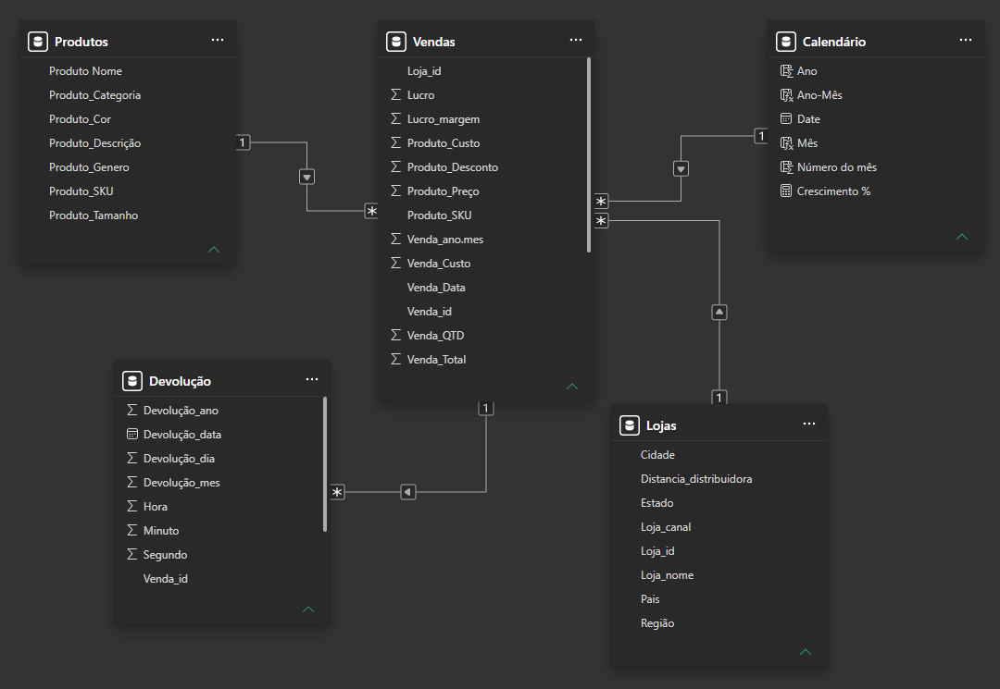
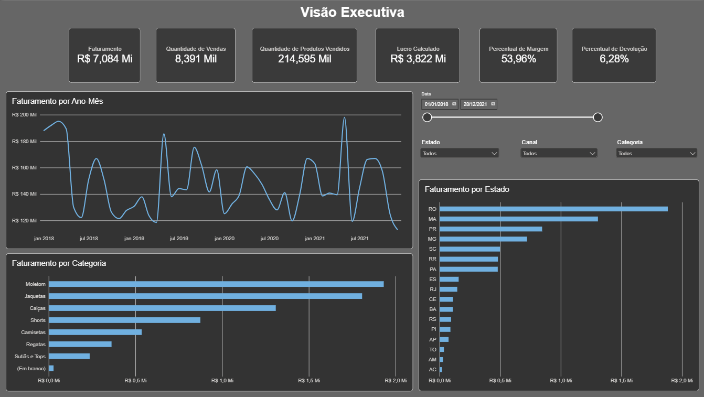
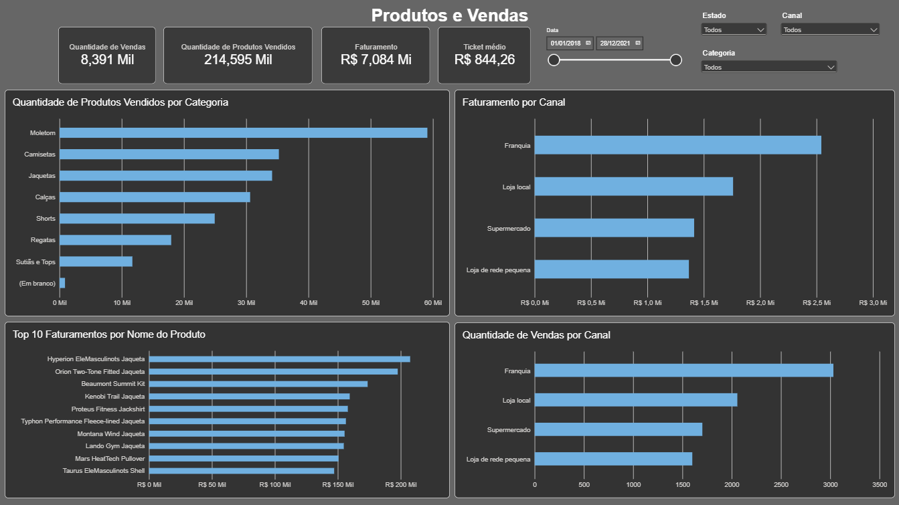
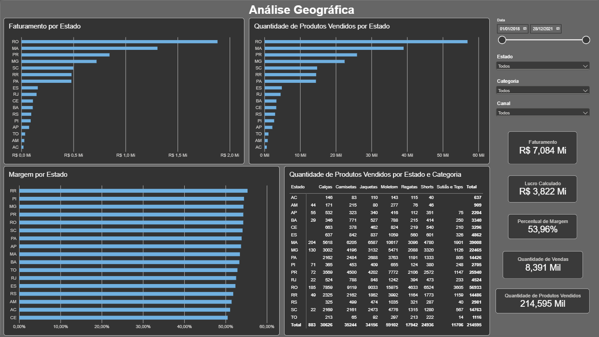
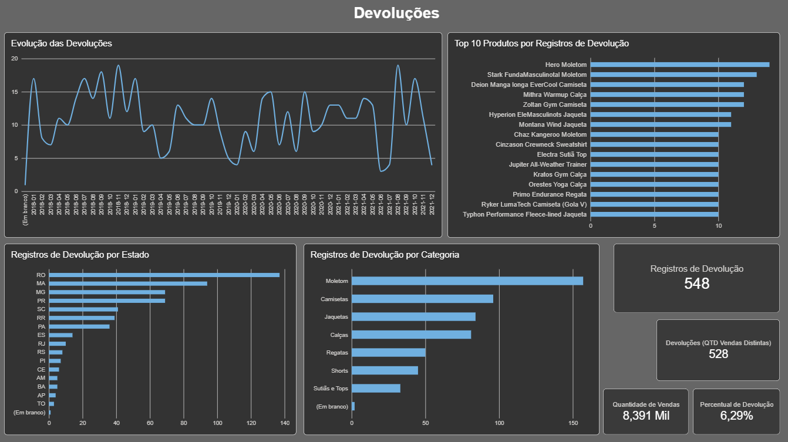

# 📊 Análise de Vendas — Power BI

## 🎯 Objetivo

Projeto de análise de dados desenvolvido com Power BI, com o objetivo de transformar dados de vendas em informações e indicadores que auxiliem na análise do desempenho comercial.

O projeto contempla todo o processo, desde a preparação e validação dos dados até a modelagem, criação de medidas DAX, construção de um dashboard interativo e análise dos principais insights.

---

## 🗂️ Dados

O projeto utiliza uma base de dados fictícia composta por quatro arquivos Excel:

| Arquivo          | Descrição               | Registros |
| ---------------- | ----------------------- | --------: |
| `Vendas.xlsx`    | Registros de vendas     |     8.391 |
| `Produtos.xlsx`  | Cadastro de produtos    |     1.210 |
| `Lojas.xlsx`     | Cadastro de lojas       |       786 |
| `Devolucao.xlsx` | Registros de devoluções |       548 |

Os dados são fictícios e utilizados exclusivamente para fins de estudo e desenvolvimento de portfólio.

---

## 🧩 Modelagem dos Dados

O modelo foi desenvolvido no Power BI utilizando relacionamentos entre as tabelas e uma tabela calendário para suporte às análises temporais.

Principais relacionamentos:

* `Produtos[Produto_SKU]` → `Vendas[Produto_SKU]`
* `Lojas[Loja_id]` → `Vendas[Loja_id]`
* `Vendas[Venda_id]` → `Devolução[Venda_id]`
* `Calendário[Date]` → `Vendas[Venda_Data]`

O modelo utiliza relacionamentos com cardinalidade adequada e direção de filtro única.

### Modelo de dados final



---

## 🛠️ Tecnologias

* **Power BI**
* **Power Query**
* **DAX**
* **Microsoft Excel**
* **Git**
* **GitHub**

---

## 📊 Dashboard

O dashboard foi estruturado em quatro páginas, cada uma com um objetivo específico de análise:

### 01 — Visão Executiva

Visão geral do desempenho comercial, com indicadores de faturamento, vendas, produtos vendidos, lucro, margem e devoluções.



### 02 — Produtos e Vendas

Análise de volume de produtos vendidos, faturamento por canal, principais produtos e quantidade de vendas por canal.



### 03 — Análise Geográfica

Análise do desempenho por estado, considerando faturamento, margem, quantidade de produtos vendidos e distribuição por categoria.



### 04 — Devoluções

Análise da evolução das devoluções e identificação dos produtos, estados e categorias com maior quantidade de registros de devolução.



---

## 📈 Principais Indicadores

| Indicador               |        Resultado |
| ----------------------- | ---------------: |
| Faturamento             | R$ 7,084 milhões |
| Quantidade de vendas    |            8.391 |
| Produtos vendidos       |          214.595 |
| Lucro                   | R$ 3,822 milhões |
| Margem                  |           53,96% |
| Vendas com devolução    |              528 |
| Registros de devolução  |              548 |
| Percentual de devolução |            6,29% |
| Ticket médio            |        R$ 844,26 |

> **Nota:** 548 representa a quantidade de registros na tabela de devoluções, enquanto 528 representa a quantidade distinta de vendas que possuem devolução.

---

## 🔎 Insights

Os principais insights identificados durante a análise incluem:

* **Moletom** foi a categoria com maior quantidade de produtos vendidos, com 59.102 unidades.
* Moletom apresentou liderança em quantidade vendida na maioria dos estados analisados, com exceções nos estados do **Acre (AC)**, onde **Calças** apresentaram o maior volume, com **146 unidades vendidas**, contra **143 unidades de Moletom** e **Amapá (AP)** onde **Camisetas** apresentaram o maior volume, com **532 unidades vendidas**, contra **416 unidades de Moletom**
* O canal **Franquia** apresentou o maior faturamento entre os canais analisados.
* **Rondônia (RO)** apresentou o maior faturamento entre os estados.
* As devoluções apresentaram maior concentração na categoria **Moletom**.
* Entre os registros de devolução, alguns produtos apresentaram incidência significativamente superior aos demais, merecendo atenção específica.

Uma análise detalhada dos insights, possíveis interpretações e pontos de atenção está disponível em `documentacao/09_insights_finais.md`.

---

## 📁 Estrutura do Projeto

```text
projeto-power-bi/
│
├── dados/
│   ├── vendas.xlsx
│   ├── produtos.xlsx
│   ├── lojas.xlsx
│   └── devolucao.xlsx
│
├── documentacao/
│   ├── 01_contexto.md
│   ├── 02_dados.md
│   ├── 03_modelagem.md
│   ├── 04_indicadores.md
│   ├── 05_medidas_dax.md
│   ├── 06_analise.md
│   ├── 07_planejamento_dashboard.md
│   ├── 08_construcao_dashboard.md
│   └── 09_insights_finais.md
│
├── imagens/
│   ├── modelo-dados.png
│   ├── modelo-dados-final.png
│   ├── dashboard-visao-geral.png
│   ├── dashboard-produtos.png
│   ├── dashboard-geografico.png
│   └── dashboard-devolucoes.png
│
├── powerbi/
│   └── projeto-vendas.pbix
│
└── README.md
```

---

## 📚 Documentação

O desenvolvimento do projeto foi documentado em etapas, incluindo:

* Contexto e objetivo
* Preparação e validação dos dados
* Modelagem
* Definição dos indicadores
* Medidas DAX
* Análise exploratória
* Planejamento do dashboard
* Construção do dashboard
* Insights finais

---

## 🚀 Status

**Concluído.**
