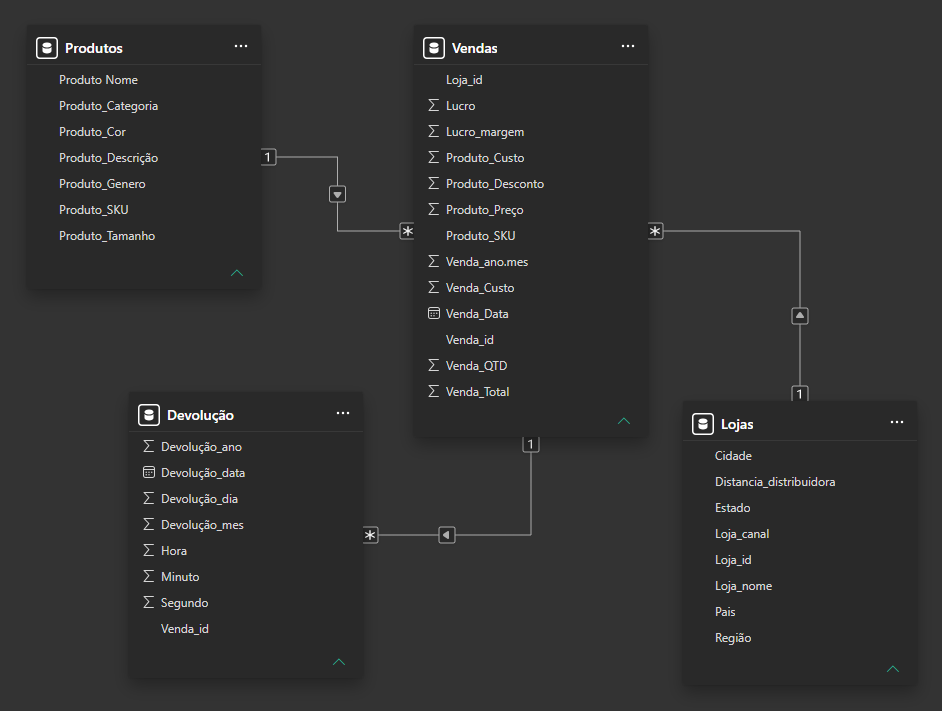

# Modelagem dos Dados

## 1. Objetivo

Construir um modelo de dados no Power BI que permita analisar as vendas de forma detalhada, relacionando produtos, lojas e devoluções.

O modelo deve permitir análises de:

* vendas por produto;
* vendas por categoria/tipo de produto;
* vendas por loja;
* vendas por estado;
* evolução das vendas ao longo do tempo;
* devoluções relacionadas às vendas.

---

## 2. Tabelas utilizadas

O modelo é composto por quatro tabelas:

| Tabela | Tipo | Função |
| :--- | :--- | :--- |
| `Produtos` | Dimensão | Cadastro e informações dos produtos |
| `Lojas` | Dimensão | Cadastro e informações das lojas |
| `Vendas` | Fato | Registro das transações de vendas realizadas |
| `Devolução` | Fato | Registro das devoluções relacionadas às vendas |

A tabela `Vendas` funciona como a principal tabela transacional do modelo.

---

## 3. Chaves utilizadas

### Produtos

**Chave primária:**

* `Produtos[Produto_sku]`

Validação realizada no Power Query:

* 1.210 valores distintos;
* 1.210 valores exclusivos;
* 0% de erros;
* 0% de valores vazios.

### Lojas

**Chave primária:**

* `Lojas[Loja_id]`

Validação realizada no Power Query:

* valores distintos = valores exclusivos = total de registros;
* 0% de erros;
* 0% de valores vazios.

### Vendas

**Chave primária:**

* `Vendas[Venda_id]`

Validação realizada no Power Query:

* 8.391 valores distintos;
* 8.391 valores exclusivos;
* 0% de erros;
* 0% de valores vazios.

### Devolução

**Chave estrangeira:**

* `Devolução[Venda_id]`

A coluna pode possuir valores repetidos porque uma mesma venda pode estar associada a mais de um registro de devolução.

Validação realizada no Power Query:

* 528 valores distintos;
* 509 valores exclusivos;
* 548 registros;
* 0% de erros;
* 0% de valores vazios.

---

## 4. Relacionamentos

### Produtos → Vendas

**Relacionamento:**

`Produtos[Produto_sku] 1 → N Vendas[Produto_sku]`

* Cardinalidade no Power BI: `Muitos para um (*:1)`, considerando a tabela Vendas no lado esquerdo.
* Direção do filtro cruzado: `Único`.

**Justificativa:**

Um produto pode aparecer em diversas vendas, enquanto cada registro de venda está associado a um produto.

---

### Lojas → Vendas

**Relacionamento:**

`Lojas[Loja_id] 1 → N Vendas[Loja_id]`

* Cardinalidade no Power BI: `Muitos para um (*:1)`, considerando a tabela Vendas no lado esquerdo.
* Direção do filtro cruzado: `Único`.

**Justificativa:**

Uma loja pode realizar diversas vendas, enquanto cada registro de venda está associado a uma loja.

---

### Vendas → Devolução

**Relacionamento:**

`Vendas[Venda_id] 1 → N Devolução[Venda_id]`

* Cardinalidade no Power BI: `Muitos para um (*:1)`, considerando a tabela Devolução no lado esquerdo.
* Direção do filtro cruzado: `Único`.

**Justificativa:**

Uma venda pode possuir mais de um registro de devolução. Por isso, `Vendas[Venda_id]` funciona como chave do lado 1 e `Devolução[Venda_id]` como chave estrangeira do lado N.

---

## 5. Direção dos filtros

Os relacionamentos foram configurados com direção de filtro **Único**.

Isso segue a boa prática de propagação de filtros das tabelas Dimensão em direção às tabelas Fato, reduzindo o risco de ambiguidade e mantendo o modelo mais simples e previsível.

```text
Produtos (1) ─────→ (N) Vendas (N) ←───── (1) Lojas
                                                   │(1)
                                                    ↓
                                                   (N)
                                              Devolução
```

Considerando a direção lógica:

```text
Produtos ──→ Vendas
Lojas ─────→ Vendas
Vendas ────→ Devolução
```

---

## 6. Validação do modelo

Foram verificadas as seguintes características:

* [x] Tabelas necessárias incluídas;
* [x] Chaves identificadas;
* [x] Cardinalidades verificadas;
* [x] Direção dos filtros verificada;
* [x] Relacionamentos sem necessidade de duplicação;
* [x] Chaves primárias validadas;
* [x] Chaves estrangeiras identificadas;
* [x] Modelo compatível com as análises propostas no levantamento de requisitos.

---

## 7. Decisões de modelagem

### Produtos

`Produto_sku` foi utilizado como chave por apresentar valores únicos e não vazios.

### Lojas

`Loja_id` foi utilizado como chave por apresentar valores únicos e não vazios.

Possíveis nomes de lojas semelhantes não foram tratados como duplicidades, pois possuem identificadores diferentes e podem representar unidades/canais distintos.

### Vendas

`Venda_id` foi considerado identificador único da venda.

### Devolução

Os registros repetidos de `Venda_id` não foram removidos, pois uma mesma venda pode possuir múltiplos registros de devolução.

A coluna `Devolução_mes_1` foi renomeada para `Devolução_dia`, pois representa o dia do mês.

---

## 8. Diagrama do modelo

O diagrama do modelo foi validado no Power BI e salvo como:



---

## 9. Conclusão

O modelo apresenta os relacionamentos necessários para conectar produtos, lojas, vendas e devoluções.

A estrutura permite avançar para a criação das medidas DAX e dos indicadores de negócio definidos na etapa de requisitos.
